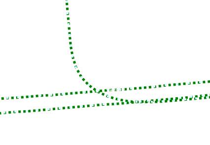

# Road Map

Former libRoadMap. Tool to record or read trajectories (as OSM files) to use them later for automatic driving.

Provides efficient functions to get the closest trajectory point to the current position, the distance from the trajectory, current arclength position, heading, etc.

To record a map with ros, use [road_map_ros_tool](https://gitlab.mrt.uni-karlsruhe.de/MRT/road_map_ros_tool). To transform object positions into a map coordinate system, use [road_map_matcher_ros](https://gitlab.mrt.uni-karlsruhe.de/gcdc/road_map_matcher_ros).

## Known issues

* Only trajectories with a length of 5 points or more are supported correctly when searching closest points or similar
* All important members of the trajectory are public to provide simple access, but should be treated as read-only variables

## License

This program is used internally at the MRT (Measurement and Control department of the Karlsruhe Institute of Technology) and the MPS department of FZI Forschungszentrum Informatik at the KIT.
For other uses, please contact the maintainer.
